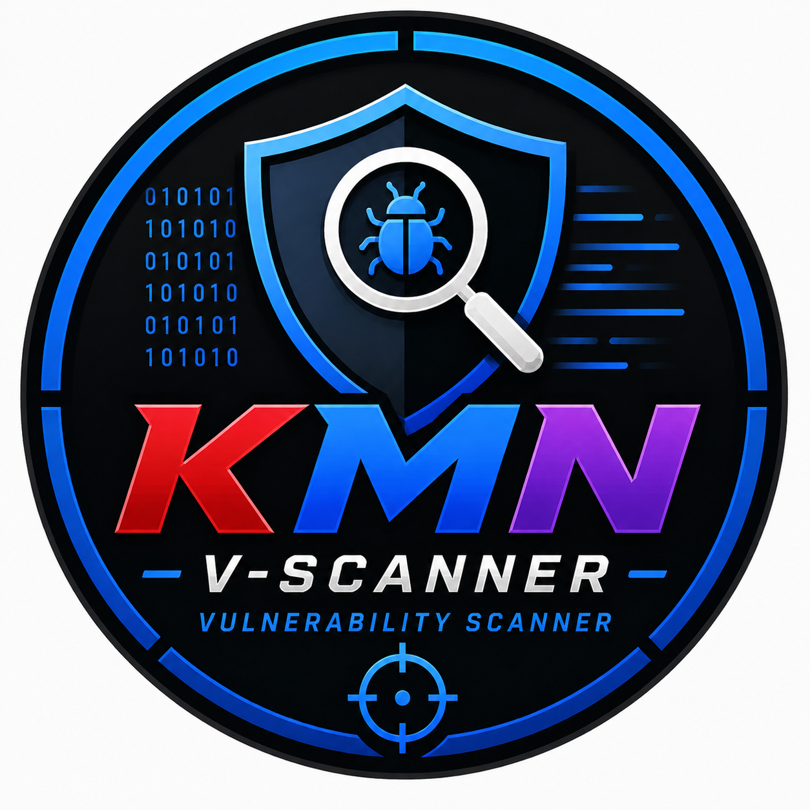

# KMN Vulnerability Scanner

<p align="center">
  
</p>

KMN Vulnerability Scanner is a local-first, open-source scan workbench. It combines discovery and vulnerability tools behind one persistent job and finding model instead of pretending that one tool can cover every security check.

Version: **3.0.0**

## What It Does

- Discovers open TCP services with Nmap
- Detects HTTP/HTTPS services and builds scan URLs
- Runs safe Nuclei templates when Nuclei is installed
- Checks HTTPS configuration with testssl.sh when available
- Runs OWASP ZAP baseline checks when explicitly enabled and available
- Normalizes findings into one risk register
- Stores scan jobs, services, findings, and tool runs in SQLite
- Shows progress, scanner availability, service inventory, and findings in a responsive dashboard
- Provides optional NVD CVE keyword search with a slower no-key fallback
- Supports quick, standard, and deep scan profiles
- Works on Kali Linux and supports both `amd64` and `arm64` Docker hosts

The scanner is not a replacement for a credentialed enterprise scanner. Authenticated Linux/Windows checks, Greenbone integration, schedules, and multi-user access are planned adapter features.

## Safety

Only scan systems and networks that you own or are explicitly authorized to assess. The local application allows private, loopback, and link-local targets by default. To enable an authorized external target, set `ALLOW_EXTERNAL_TARGETS=true` in `.env` and keep the service bound behind suitable access control.

The application does not store credentials in this release. Do not put credentials or API keys in source code, shell scripts, Docker Compose files, or the database.

NVD search is optional. Leave `NVD_API_KEY` blank for unauthenticated requests, or add a personal free key to the local `.env` file to receive the higher NVD rate limit. The key is never part of the repository.

## API Keys and `.env`

The core scanner does not require an API key. Nmap, Nuclei, testssl.sh, and OWASP ZAP run with their local installations. Only the optional NVD CVE reference search can use an NVD API key.

### Get an NVD API Key

1. Create or sign in to an NVD account at [nvd.nist.gov](https://nvd.nist.gov/).
2. Open the [NVD API key request page](https://nvd.nist.gov/developers/request-an-api-key).
3. Submit the request and follow the instructions sent by NVD.
4. Copy the key from the NVD message. Do not paste it into GitHub issues, README files, screenshots, or shell history.

An NVD key is free, but it is still a private credential tied to the requester's account and rate limit. Do not share one key with repository users.

### Configure the Key

Create the local environment file:

```bash
cp .env.example .env
chmod 600 .env
```

Open `.env` and set only your local key:

```env
NVD_API_KEY=your_personal_nvd_api_key
```

The `.env` file is ignored by Git and is loaded automatically when running `./manage.sh run`. It is also passed to Docker Compose through environment-variable interpolation. Leave the value empty if you do not need NVD search:

```env
NVD_API_KEY=
```

Without a key, NVD search still works with a slower unauthenticated rate limit. If NVD returns a rate-limit error, wait before retrying or configure your own key. The key is never needed to run network scans.

If an NVD key was ever committed to this repository or another public location, deleting the line is not enough. Revoke that key and request a new one because the old value may remain in Git history.

## Kali Installation

### One-command setup

On a fresh Kali installation, clone the repository and run the installer. It installs the required system packages, creates the Python virtual environment, installs project dependencies, creates a protected local `.env`, and starts the dashboard:

```bash
git clone https://github.com/KhitMinnyo/KMN-V-Scanner.git
cd KMN-V-Scanner
./setup.sh
```

Open `http://127.0.0.1:2025`. Stop the server with `Ctrl+C`.

The installer supports Python 3.9 through Python 3.14. The pinned Pydantic release has prebuilt wheels for both `amd64` and `arm64`, so a normal install does not require Rust or Cargo.

To install without starting the server:

```bash
./setup.sh --no-run
./manage.sh run
```

The installer supports `amd64` and `arm64` Kali systems and attempts to install the matching Nuclei binary. Optional tools that cannot be installed are reported by `./manage.sh doctor`; the application continues with the tools that are available.

Install the base scanner tools:

```bash
sudo apt update
sudo apt install -y nmap testssl.sh
```

Install Nuclei using the official ProjectDiscovery release instructions or your approved package source. OWASP ZAP is optional and can be installed separately.

Then install and run KMN:

```bash
./manage.sh install
cp .env.example .env
./manage.sh doctor
./manage.sh run
```

Open `http://127.0.0.1:2025`.

`logo.png` is served as both the favicon and the dashboard logo. The supplied 1254x1254 PNG is square and does not need preprocessing; CSS constrains its display size.

## Docker

Docker Desktop, Docker Engine, and Docker Compose support the same application on `amd64` and `arm64` hosts. The Dockerfile downloads the matching Nuclei release binary using Docker's automatic target architecture, so it does not compile Nuclei or rely on a hardcoded CPU architecture.

```bash
cp .env.example .env
docker compose up --build
```

Open `http://127.0.0.1:2025`. Scan data is persisted in `./data/scanner.db`.

To build for both architectures from a machine with Docker Buildx:

```bash
docker buildx build --platform linux/amd64,linux/arm64 \
  -t kmn-v-scanner:3.0.0 --push .
```

ZAP is intentionally not bundled in the base image because it is a large optional dependency and its packaging differs between platforms. The adapter detects `zap-baseline.py` or `zap-baseline` if installed on the scan worker.

## Scan Profiles

- `quick`: TCP ports 1-1024 and light web checks
- `standard`: TCP ports 1-10000 and enabled safe checks
- `deep`: TCP ports 1-65535 and optional ZAP baseline checks

Nmap service/version output is treated as asset inventory. A service name/version alone is not considered a confirmed CVE. Findings require evidence from a scanner adapter.

## Project Structure

```text
app/
  main.py              FastAPI routes and static file serving
  config.py            Environment-based configuration
  database.py          SQLite schema and persistence
  schemas.py           API request validation
  scanners/
    runner.py          Timeout, cancellation, and subprocess boundary
    target.py          Target validation and normalization
    nmap.py            Service discovery adapter
    nuclei.py          Safe-template adapter
    tls.py             testssl.sh adapter
    zap.py             Optional ZAP baseline adapter
  services/jobs.py     Persistent scan orchestration
static/                Dashboard CSS and JavaScript
templates/             Dashboard HTML
tests/                 Parser and validation tests
```

## API

- `GET /api/health`
- `GET /api/tools`
- `GET /api/dashboard`
- `POST /api/scans`
- `GET /api/scans`
- `GET /api/scans/{id}`
- `POST /api/scans/{id}/cancel`
- `GET /api/findings`
- `GET /api/cves/search?q=log4j`

Example request:

```bash
curl -X POST http://127.0.0.1:2025/api/scans \
  -H 'Content-Type: application/json' \
  -d '{"target":"127.0.0.1","profile":"quick"}'
```

## Development

```bash
./manage.sh install
source .venv/bin/activate
python -m pip install -r requirements-dev.txt
pytest -q
```

Run syntax checks without scanner binaries:

```bash
python -m compileall app app.py tests
```

## License

The KMN application is released under the MIT License. External tools and their templates retain their own licenses and terms. Review those terms before redistribution or commercial use.
